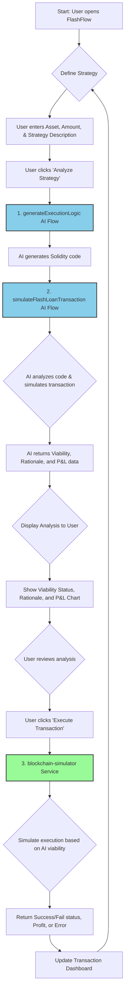

# FlashFlow: AI-Powered Flash Loan GUI

[](https://opensource.org/licenses/MIT)

FlashFlow is a modern, AI-driven Next.js application that provides a user-friendly graphical interface for designing, simulating, and executing flash loans. It demystifies the complex world of decentralized finance (DeFi) by allowing users to define their strategies in natural language. The application leverages Google's Generative AI to generate the underlying Solidity logic, analyze the viability of the proposed transaction, and simulate the potential outcome before it's ever sent to the blockchain.


*<p align="center">A placeholder for the application's user interface.</p>*

---

## The Problem

[Flash loans](https://docs.aave.com/developers/v/2.0/guides/flash-loans) are a powerful, uncollateralized lending tool unique to DeFi. They allow users to borrow massive amounts of cryptocurrency for a single transaction, as long as the loan is repaid by the end of that same transaction. This opens up incredible opportunities for arbitrage, liquidations, and other complex financial maneuvers.

However, the technical complexity of creating and executing the necessary smart contracts makes flash loans inaccessible to most people. A single mistake in the code can lead to a failed transaction and lost gas fees. This high barrier to entry prevents widespread adoption and innovation.

## The Solution

FlashFlow solves this problem by providing an intuitive graphical user interface (GUI) where users can simply describe their strategy in natural language. An AI model then handles the complexity of generating, analyzing, and simulating the required smart contract, making the power of flash loans accessible to a much broader audience.

---

## Key Features

-   **Natural Language Strategy Input:** Describe your flash loan strategy in plain English. No Solidity knowledge required.
-   **AI-Powered Code Generation:** A Genkit flow uses an AI model to convert your strategy into secure and efficient Solidity code in the background.
-   **AI Transaction Simulation:** Before execution, an AI-powered analyst simulates the transaction, assessing its viability and estimating potential profit or loss.
-   **Interactive P&L Chart:** Visualize the simulated financial performance of your strategy with a clear and dynamic chart.
-   **Persistent Transaction Dashboard:** Monitor the status and review the profit/loss or error messages of your past flash loan attempts.
-   **Built with Modern Tech:**
    -   **Framework:** [Next.js](https://nextjs.org/) (App Router)
    -   **Language:** [TypeScript](https://www.typescriptlang.org/)
    -   **AI Integration:** [Google AI (Genkit)](https://firebase.google.com/docs/genkit)
    -   **UI Components:** [ShadCN UI](https://ui.shadcn.com/)
    -   **Styling:** [Tailwind CSS](https://tailwindcss.com/)
    -   **Charting:** [Recharts](https://recharts.org/)
    -   **Schema Validation:** [Zod](https://zod.dev/)

---

## Application Flow Diagram

The diagram below illustrates the complete user workflow, from defining a strategy to seeing the results on the dashboard.



---

## Folder Structure

The project follows a standard Next.js App Router structure. Key directories are highlighted below.

```
.
├── src
│   ├── ai
│   │   ├── flows                 # Contains all Genkit AI flows
│   │   │   ├── generate-execution-logic.ts
│   │   │   └── simulate-flash-loan-transaction.ts
│   │   ├── dev.ts                # Genkit development server entrypoint
│   │   └── genkit.ts             # Genkit global configuration
│   │
│   ├── app                       # Next.js App Router pages
│   │   ├── globals.css           # Global styles and ShadCN theme
│   │   ├── layout.tsx            # Root layout
│   │   └── page.tsx              # Main application page
│   │
│   ├── components
│   │   ├── ui                    # ShadCN auto-generated UI components
│   │   ├── flash-loan-builder.tsx  # Core component for building the loan
│   │   ├── header.tsx            # Site header
│   │   ├── icons.tsx             # Custom SVG icons
│   │   ├── page-wrapper.tsx      # Main content wrapper
│   │   └── transaction-dashboard.tsx # Component for the history dashboard
│   │
│   ├── hooks
│   │   └── use-toast.ts          # Logic for showing toast notifications
│   │
│   ├── lib
│   │   └── utils.ts              # Utility functions (e.g., cn for Tailwind)
│   │
│   ├── services
│   │   └── blockchain-simulator.ts # Mock service for transaction execution
│   │
│   └── types
│       └── index.ts              # TypeScript type definitions
│
├── .env                          # Environment variables (GEMINI_API_KEY)
├── next.config.ts                # Next.js configuration
├── package.json
└── README.md
```

---

## Getting Started

To get a local copy up and running, follow these simple steps.

### Prerequisites

-   Node.js (v18 or later)
-   npm or yarn

### Installation

1.  **Clone the repo**
    ```sh
    git clone https://github.com/Sharmamayankkkk/FlashFlow.git
    cd FlashFlow
    ```
2.  **Install NPM packages**
    ```sh
    npm install
    ```
3.  **Set up your environment variables**
    Create a `.env` file in the root of the project and add your Google AI API key. You can get a key from [Google AI Studio](https://aistudio.google.com/app/apikey).
    ```
    GEMINI_API_KEY=YOUR_API_KEY
    ```
4.  **Run the development server**
    The application requires two concurrent processes: the Next.js frontend and the Genkit AI server.
    
    In your first terminal, run the Next.js app:
    ```sh
    npm run dev
    ```
    
    In your second terminal, run the Genkit server:
    ```sh
    npm run genkit:watch
    ```

Open [http://localhost:9002](http://localhost:9002) with your browser to see the result.

---

## Developed by

**Mayank Sharma**

-   GitHub: [@Sharmamayankkkk](https://github.com/Sharmamayankkkk)

---

## License

Distributed under the MIT License. See `LICENSE` for more information.
